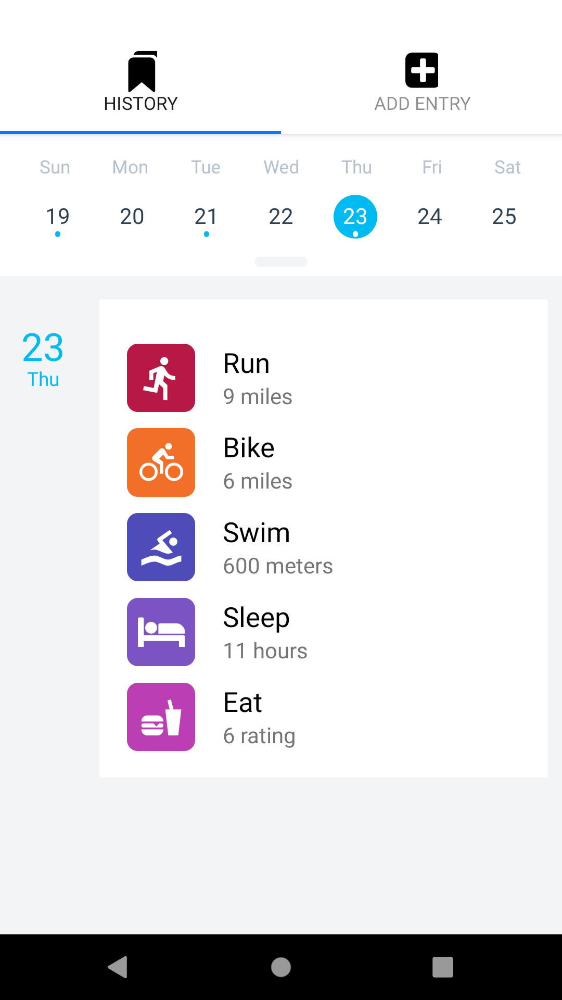

# Activity Tracker

`An application which logs user fitness activities. User can add how much it sleeps, runs, bikes or swims and eating activity. User has history of all the activities and can check them in calender by accessing the day from calender. User can also edit the activity log.`

### Libraries used
- React-Native
- Redux
- Wix Calender
- Redux thunk
- Redux logger

### *Tested on Android Emulator and Expo(Android and iOS).*

### To start app
- `npm install` or `yarn install`
- `expo start` or `npx react-native start`
- `yarn start` or `npm start`

## Screenshots

### Homepage

### Calender

### Added Entry

